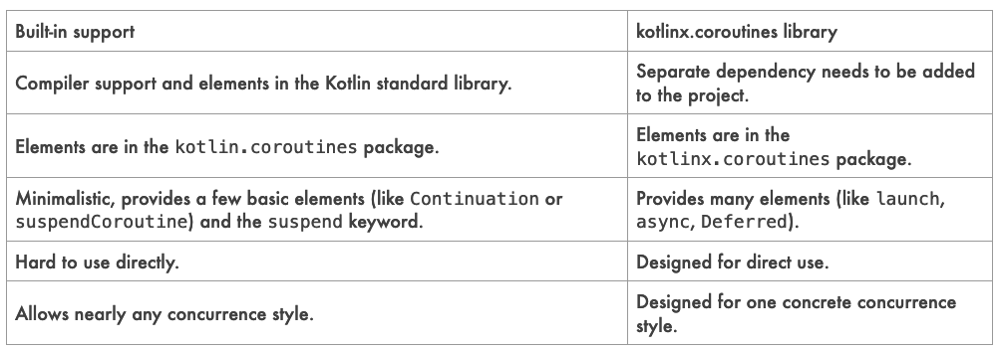

# Co to jest korutyna ?

Jest to zestaw komponentów które pozwalają na czasowe zawieszenie oraz późniejsze wznowienie
wykonywania fragmentu kodu. 

Koncepcyjnie korutyna jest zbliżona do wątku, ponieważ jest to blok kodu, który
wykonywany jest równolegle z resztą kodu. 
Główną różnicę stanowi fakt, że nie jest ona częścią żadnego wątku. 
Może być zatrzymana w jednym wątku a wznowiona w zupełnie innym. 

1. W wątku głównym uruchamiany jest kosztowny kod (np pobieranie danych przez API)
2. Tworzony jest save point
3. Wątek główny jest cały czas wolny - może obsługiwać inne korutyny lub widok
4. Gdy w miejscu save pointu pojawią się dane korutyna czeka na wątek główny
5. Gdy wątek będzie wolny następuje wznowienie go od savepointu

Mechanizm zamieszania polega na zatrzymaniu wykonywania kodu w określonym miejscu.

```kotlin
 @Test
    fun test2() = runTest {
        println("Before")
        //zawieszenie bieżącego wątku
        //w lambdzie kod, który ma się wykonać na chwilę
        //PRZED zawieszeniem
        suspendCoroutine { cont: Continuation<Unit> ->
            //powołuję nowy wątek
            thread {
                //usypiam go na 1 s
                Thread.sleep(1000)
                //wątek się wybudza i wznawia korutynę
                //UWAGA! odwiesza inny wątek niż zawiesił!
                cont.resume(Unit)
            }
        }
        println("After")
    }
```

# Sequence generator - przykład wykorzystania mechanizmu zawieszania

Sequence jest strukturą przypominającą kolekcje, jednak poszczególne jej elementy wyznaczane
są na żądanie, tylko w razie potrzeby. 

Generatory sekwencji wykorzystują mechanizm zawieszania. Kod zatrzymywany jest
w miejscu wywołania funkcji *yeld*, przy następnym odwołaniu sekwencji
kod jest odwieszany i wykounuje się jeszcze raz.

Mechanizm zawieszania powoduje że wykonywane są skoki pomiędzy wątkiem głównym
a generatorem sekwencji.

```kotlin
 @Test
    fun test() = runTest {
      val seq= sequence<Int> {
          //pętla nieskończona
          while (true){
              println("Generate item")
              //generujemy i zamrażamy
              yield(Random.nextInt(0,100))
          }
      }

        val it=seq.iterator()
        
        println("Number 1=>${it.next()}")
        println("Number 2=>${it.next()}")
        println("Number 3=>${it.next()}")

    }
```

```
Generate item
Number 1=>42
Generate item
Number 2=>99
Generate item
Number 3=>82
```

Generatory sekwencji mogą pamiętać stan, poniżej przykład generujący wartość funkcji silnia

```kotlin
    @Test
    fun shouldReturnPower() = runTest {
        val seq= sequence<Pair<Int,Int>> {
            var previousPower=1
            var elem=1

            while (true){
                val power=previousPower*elem
                println("Generate power for item=${elem}")
                yield(Pair(elem,power))
                previousPower=power
                elem++
            }
        }

        seq.take(7).forEach {
            println("Power=>${it}")
        }
    }

```

```kotlin
Generate power for item=1
Power=>(1, 1)
Generate power for item=2
Power=>(2, 2)
Generate power for item=3
Power=>(3, 6)
Generate power for item=4
Power=>(4, 24)
Generate power for item=5
Power=>(5, 120)
Generate power for item=6
Power=>(6, 720)
Generate power for item=7
Power=>(7, 5040)
```
# Wsparcie natywne vs biblioteka kotlinx.coroutines

**Wsparcie natywne**
* Obejmuje zestaw mechanizmów niskopoziomowych, które dają programiście dużą swobodę wykorzystania
* Dostarcza elementów takich jak *suspendCoroutine* oraz *Continuation*
* Ich przenaczeniem jest wykorzystanie w bibliotekach a nie w kodzie biznesowym

**Wsparcie biblioteczne**
* Wymaga dostarczenia ich w formie osobnej dependency
* Zestaw mechanizmów wypracowanych zawierających dobre praktyki wykorzystania
* Przeznaczone do użycia w kodzie biznesowym



# Coroutine builders

Funkcja suspendowalna może wołać normalną metodę, ale normalna metoda nie może wołać funkcji
suspendowalnej. 

Metoda suspendowalna może być wołana tylko z innej metody suspendowalnej. 

Jednak jak rozpocząć ten łańcuch wywołań, bo przecież na jego początku jest funkcja zwykła ?

Z pomocą przychodzi biblioteka kotlinx.coroutines, która dostarcza trzech coroutine builders: 

* launch
* async
* runBlocking

## Builder - launch

Jest to mechanizm bardzo zbliżony do mechanizmu tworzenia nowego wątku,
spójrzmy na ten przykład:

```kotlin
fun main() {
    GlobalScope.launch {
        delay(1000L)
        println("World!")
    }
    GlobalScope.launch {
        delay(1000L)
        println("World!")
    }
    GlobalScope.launch {
        delay(1000L)
        println("World!")
    }
    println("Hello,")
    Thread.sleep(2000L)
}
```

Co tu się dzieje ?

Uruchamiana jest funkcja main a następnie niezależnie od siebie trzy korutyny, które
zawieszają się na 1 s. Efekt ten jest bardzo zbliżony do efektu tworzenia nowego wątku.

Uwaga! jak działa metoda *delay()* ? 

Metoda ta **NIE BLOKUJE WĄTKU** a tylko zawiesza (a potem odwiesza) korutynę! 

Z tego też powodu, by dało się obejrzeć wyniki działania korutyn należy zatrzymać wątek główny
czyli wykonać *Thread.sleep()* na końcu. 

Wynik działania będzie następujący:

```kotlin
Hello,
(DELAY-1s)
World!
World!
World!
```
Korutyny zostają wystartowane i czekają 1 sekundę, zatem pierwsze wyświetlone zostanie 
"Hello", potem wątek zostaje zablokowany na 2 sekundy, pozwala to wybudzić się korutynom
i każda z nich wyświetli swoje "World".


## Builder - runBlocking


Jest to bardzo nietypowy builder, którego użycie jest nieco sprzeczne z ideą korutyn. Mianowicie
powoduje on zablokowanie wątku zaraz po wystartowaniu korutyny!

```kotlin
fun mainRunBlocking() {
    runBlocking {
        delay(1000L)
        println("World!")
    }
    runBlocking {
        delay(1000L)
        println("World!")
    }
    runBlocking {
        delay(1000L)
        println("World!")
    }
    println("Hello,")
}
```

W wyniku wykonania tego kodu po uruchomieniu każdej z korutyn program zatrzyma się na 1 s.

Wynik jego działania będzie następujący:

```kotlin
(STOP-1s)
World!
(STOP-1s)
World!
(STOP-1s)
World!
Hello,
```
Builder ten jest przydatny jeśli chcemy świadomie zatrzymać wątek by program się nie skończył
np w testach lub funkcji *main()*
````kotlin
fun main() = runBlocking {
// ...
}


@Test
fun `test`() = runBlocking {
    
}

````

** UWAGA! - builder ten jest rzadko używany, w testach stosuje się  *runTest* a main jest
często suspendowalna**

## Builder - async

Jest to builder podobny do bildera *launch* , ale stosuje się go w sytuacji gdy produkowana
jest wartość. Musi ona być zwracana przez lambdę. 
Funkcja *async* zwraca obiekt typu *Deferred<T>*, gdzie *T* jest typem produkowanej wartości. 
Typ ten posiada metodę *await()* zwracającą wartoś tylko wtedy gdy jest ona gotowa. 

Tak samo jak w przypadku *launch* , metoda *async()* tworzy korutynę natychmiast po uruchomieniu. 
W obiekcie *Deferred* uzyskujemy referencję do wyniku. 

Jeśli metoda *await()* zostanie zawołana zanim wynik będzie gotowy to korutyna zostanie uśpiona.

```
Uwaga! Builder async doskonale nadaje się do zrównoleglania wywołań do zdalnych repozytoriów/usług.

```

```kotlin
scope.launch {
val news = async {
newsRepo.getNews()
.sortedByDescending { it.date }
}
val newsSummary = newsRepo.getNewsSummary()
// we could wrap it with async as well,
// but it would be redundant
view.showNews(
newsSummary,
news.await()
)
}

```
# Structured Concurrency

Powróćmy chwilę do następującego przykładu:

```kotlin
fun main() {
    GlobalScope.launch {
        delay(1000L)
        println("World!")
    }
    println("Hello,")
    Thread.sleep(2000L)
}
```
Builder *launch* uruchamiany jest na obiekcie *GlobalScope* - jest to obiekt rozszerzający
*CoroutineScope*.

```kotlin
public object GlobalScope : CoroutineScope
```

W powyższym przykłdzie kod korutyny zostanie uruchomiony w oderwaniu od jakiegokolwiek przepływu
a jego wynik będzie niezauważalny jeśli nie nastąpi sztuczne uśpienie wątku. 

Przyjrzyjmy się chwilę definicji metod builderów

```kotlin

fun <T> runBlocking(
context: CoroutineContext = EmptyCoroutineContext,
block: suspend CoroutineScope.() -> T
): T

fun CoroutineScope.launch(
context: CoroutineContext = EmptyCoroutineContext,
start: CoroutineStart = CoroutineStart.DEFAULT,
block: suspend CoroutineScope.() -> Unit
): Job

fun <T> CoroutineScope.async(
context: CoroutineContext = EmptyCoroutineContext,
start: CoroutineStart = CoroutineStart.DEFAULT,
block: suspend CoroutineScope.() -> T
): Deferred<T>
```

Zwróćmy uwagę na kilka szczegółów. 

* *launch* i *async* są metodami rozszerzającymi interfejs *CoroutineScope*
* *runBlocking* nie rozszerza interfejsu *CoroutineScope*
* każdy z builderów w ostatnim parametrze o nazwie *block* przyjmuje funkcję której receiverem jest *CoroutineScope*

```kotlin
It is because
launch and async are extension functions on the CoroutineScope.
However, if you take a look at the definitions of these and of
runBlocking, you will see that the block parameter is a function type
whose receiver type is also CoroutineScope.
```

Mają one głębokie konsekwencje. Dzięki tym relacjomo możliwe jest budowanie relacji pomiędzy 
korutynami. Ta hierchiczna relacja nazywana jest _**structured concurrency**_

Korutyna zewnętrzna (parent) dostarcza kontekstu wywołania dla korutyn wewnętrznych. Tworzona
jest zależność rodzic-dziecko. 
Kontekst rodzica przejmuje odpowiedzialność za konteksty potomne. Znaczy to, że korutyna
zewnętrzna musi zostać zasuspendowana dopóki nie skończy się przetwarzanie korutyn potomnych.

Należy zwrócić uwagę że bilder runBlocking nie rozszerza *CoroutineScope* więc nie może być
stosowany wewnątrz zagnieżdżonego scope. Może wystąpić tylko na górze hierarchii. 

Metody *launch()* i *async()* mogą być stosowane w kontekście potomnym.

W konsekwencji:

* jeśli korutyna parent zostaje unieważniona (cancelled) jej korutyny potomne również zostają unieważnione
* jeśli korutyna potomna rzuci błąd, unieważniana jest również korutyna rodzica

```kotlin
fun main() = runBlocking {
this.launch { // same as just launch
delay(1000L)
println("World!")
}
launch { // same as this.launch
delay(2000L)
println("World!")
}
println("Hello,")
}

// Hello,
// (1 sec)
// World!
// (1 sec)
// World!
```


# Domyślny kontekst korutyny

```kotlin
suspend fun main() = coroutineScope {
    //metoda niesuspendowalna woła suspendowalną dlatego musi być w scope coroutineScope
    //lub builder runBlocking
    for (i in 1..3) {
        println(giveItemWithSerial(i))
    }
}

suspend fun giveItemWithSerial(id: Int): String = coroutineScope {
    //zrównoleglam wywołanie wołam metody suspendowalne więc sam ta również musi być suspendowalna
    //metody suspendowalne muszą być wołane z wnętrza korutyny
    val nameTask = this.async { giveItemName(id) }
    val serialTask = this.async { generateSerialNumber() }
    "${nameTask.await()} => ${serialTask.await()}"
}

suspend fun giveItemName(id: Int = 0): String {
    //skoro używamy delay - musi być suspended
    delay(1000)
    return when (id) {
        1 -> "Smartfon"
        2 -> "Rower"
        else -> "Coś ładnego"
    }
}

suspend fun generateSerialNumber(): String {
    //skoro używamy delay - musi być suspended
    delay(100)
    return UUID.randomUUID().toString()
}
```
